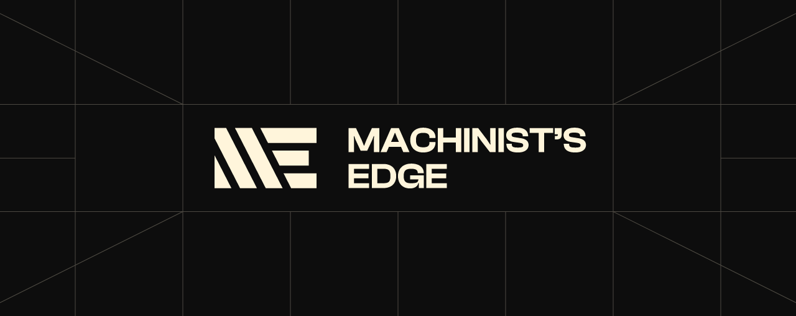

[](https://www.machinists-edge.com/)

## What is Machinist’s Edge?

Machinist’s Edge is a [SvelteKit](https://kit.svelte.dev/) web application containing useful calculators and charts designed for the [RISD industrial design metal shop](http://id.risd.edu/will-reeves-metal-shop-1).

View the [production website](https://www.machinists-edge.com/) or [development preview](https://preview.machinists-edge.com/).

## Technical Overview

Machinist’s Edge is built using [SvelteKit](https://kit.svelte.dev/), mostly written in [TypeScript](https://www.typescriptlang.org/), and styled with [Dart Sass](https://sass-lang.com/dart-sass). The production site is deployed using [Vercel](https://vercel.com/).

## Exploring Code

### View in Browser

If you just want to take a look at the code in your browser, press the <kbd>.</kbd> key to open up Visual Studio Code for the Web. Please take a look at the architecture section below to gain a better understanding of how the code is organized.

### Run Locally

You can also download the code by clicking the green “Code” button at the top of the page and selecting “Download ZIP.”

To run the code locally, you must have Node.js installed. Then, run the following in a terminal in the same folder:

```bash
# this will install all dependencies
npm i

# this will start a development server and open the app in a new browser tab
npm run dev -- --open
```

## Commit Messages

[Commit messages](https://github.com/richardfxr/machinists-edge/commits/main) are prefixed with the following labels to make them easier to read:

- ♿️A11Y: accessibility
- 🔧CNFG: configuration
- 💄CSS: styling (CSS or SCSS)
- 📐DES: design
- 📝DOC: documentation
- 🐛FIX: bug fix
- 🟠SVLT: Svelte and SvelteKit
- 🚧WIP: work in progress (broken/partial code)
- 🎉RLS: new release (main branch merge)

## Architecture

This repository is separated into the [designs](https://github.com/richardfxr/machinists-edge/tree/main/designs), [src](https://github.com/richardfxr/machinists-edge/tree/main/src), and [static](https://github.com/richardfxr/machinists-edge/tree/main/static) folders, along with a few top-level files. Top-level files such as this `README.md` file are usually configuration or documentation files.

    designs
    ├── MachinistsEdge-GitHub-banner.png           GitHub banner image
    ├── MachinistsEdge-GitHub-socialPreview.png    GitHub social preview image
    └── MachinistsEdge-UIconcepts-1.ai             Illustrator file with all assets

    src
    ├── lib                       libaray of all Svelte components
    │   └── SVGs                  all illustration and icon SVGs
    │
    ├── routes                    all Svelte file for different pages of the web app
    │   ├── g-code
    │   │   └── +page.svelte      G-code Chart page
    │   │
    │   ├── settings
    │   │   └── +page.svelte      Settings page
    │   │
    │   ├── tap-and-clearance
    │   │   └── +page.svelte      Tap & Clearance Chart page
    │   │
    │   ├── tool-length
    │   │   └── +page.svelte      Tool Length Calculator page
    │   │
    │   ├── +layout.svelte        layout file (applied to all pages)
    │   ├── +layout.ts            layout load file
    │   └── +page.svelte          Feed Rate Calculator page
    │
    ├── store
    │   └── store.ts              Svelte stores (state management)
    │
    ├── styles                    global styling
    │   ├── _colors.scss          sass map with all colors
    │   ├── _global.scss          global styles
    │   ├── _index.scss           fowards all partial SCSS files in this folder
    │   ├── _resets.scss          style resets
    │   ├── _typeface.scss        typeface imports
    │   └── _variables.scss       CSS & SCSS variables
    │
    ├── app.d.ts                  type definitions
    └── app.html                  main HTML
    
    static
    ├── typefaces                 typeface files
    └── favicon.png               favicon
